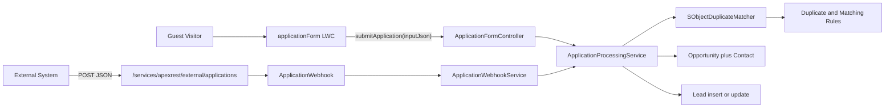

# Cloudsquare Challenge — Application Intake

Public application intake for external partners through two channels that share one Apex business service:

1. **Experience Cloud form** — guest-accessible LWC (`applicationForm`) on a public community page.
2. **REST webhook** — `POST /services/apexrest/external/applications` for external systems.

When an application arrives, the shared service looks for a matching Account (via Duplicate / Matching Rules). If one exists, it creates an Opportunity; otherwise it creates (or updates) a Lead. Both channels stamp `Application_Source__c` as `Community` or `Webhook`.

Built as Salesforce DX source (API **67.0**).

## Table of contents

- [Architecture at a glance](#architecture-at-a-glance)
- [Project structure](#project-structure)
- [Setup instructions](#setup-instructions)
- [How the Community form works](#how-the-community-form-works)
- [How the webhook works](#how-the-webhook-works)
- [Testing](#testing)
- [Requirements coverage](#requirements-coverage)
- [Assumptions and design decisions](#assumptions-and-design-decisions)
- [Known limitations](#known-limitations)

## Architecture at a glance



Sequence diagrams, duplicate-matching details, guest security, and test seams: **[docs/ARCHITECTURE.md](docs/ARCHITECTURE.md)**.

## Project structure

```
force-app/main/default/
├── classes/
│   ├── ApplicationDTO.cls                 # Input wrapper (+ nested ContactDTO)
│   ├── ApplicationResult.cls              # Output wrapper (success / recordType / recordId / message)
│   ├── ApplicationFormController.cls      # LWC Apex controller
│   ├── ApplicationWebhook.cls             # REST resource (/external/applications)
│   ├── ApplicationWebhookService.cls      # Webhook parse + HTTP response
│   ├── ApplicationProcessingService.cls   # Shared business logic
│   ├── SObjectDuplicateMatcher.cls        # Datacloud.FindDuplicates wrapper
│   ├── AccountFactory.cls / LeadFactory.cls  # Test helpers
│   └── *Test.cls                          # Unit tests
├── lwc/applicationForm/                   # Public Experience Cloud form
├── digitalExperiences/                    # Cloudsquare Portal site (Application Form page)
├── digitalExperienceConfigs/              # Site config (urlPathPrefix: cloudsquare)
├── duplicateRules/                        # Lead → Account duplicate rule
├── matchingRules/                         # Account Tax Id OR Name matching
├── sharingRules/                          # Guest read access (Account, Lead)
├── profiles/                              # Admin + Cloudsquare Portal (Guest)
├── globalValueSets/ApplicationSource      # Community | Webhook
├── objects/                               # Custom fields on Lead, Account, Opportunity
└── testSuites/ApplicationFormTests
manifest/package.xml
script/Test_ApplicationWebhookService.cls  # Execute Anonymous smoke script
docs/ARCHITECTURE.md
```

## Setup instructions

### Prerequisites

- [Salesforce CLI](https://developer.salesforce.com/tools/salesforcecli) (`sf`)
- A Salesforce org with **Experience Cloud** enabled
- Git clone of this repository

### 1. Authenticate

```bash
sf org login web --alias cloudsquare
```

### 2. Deploy metadata

Prefer a full source-dir deploy so Apex, LWC, profiles, rules, and the Experience site all go together:

```bash
sf project deploy start --source-dir force-app --target-org cloudsquare
```

### 3. Activate Experience Cloud

Site metadata is versioned under `digitalExperiences/` / `digitalExperienceConfigs/`:

| Item | Value |
| --- | --- |
| Site label | Cloudsquare Portal |
| URL path prefix | `cloudsquare` |
| Application page | `/application-form` (public) |
| LWC on the page | `c:applicationForm` |
| Guest / network | `Cloudsquare_Portal` (used by guest sharing rules) |

After deploy:

1. Open **Experience Workspaces** → **Cloudsquare Portal** → **Publish** (and activate the site if it is not already live).
2. Confirm the guest user uses the **Cloudsquare Portal Profile** and that Apex class access is enabled for `ApplicationFormController`, `ApplicationWebhook`, `ApplicationWebhookService`, `ApplicationProcessingService`, and `SObjectDuplicateMatcher`.
3. Confirm guest sharing rules `Account_CloudsquarePortal` and `Lead_CloudsquarePortal` are active.
4. Confirm matching rule `AccMR_FederalTaxId_Name` and duplicate rule `LeadDR_AccLead_Federal_Name` are **Active**.
5. Desactive all standards Lead matching / duplicate rule for Lead-to-Lead dedupe 

Public form URL (typical pattern):

```
https://<my-domain>.my.site.com/cloudsquare/application-form
```

### 4. Webhook URL

With the site live, the REST endpoint is available at:

```
https://<my-domain>.my.site.com/cloudsquare/services/apexrest/external/applications
```

(Exact host depends on your My Domain / Experience domain.)
## How the Community form works

1. Guest opens the public page and fills Company Name, Federal Tax Id, Annual Revenue, and contact fields.
2. The LWC runs `lightning-input.reportValidity()`, then an explicit `annualRevenue > 0` check.
3. It builds an `ApplicationDTO`-shaped payload, stamps `applicationSource: 'Community'`, and calls `ApplicationFormController.submitApplication`.
4. A spinner shows while Apex runs; on success the UI displays the message, **record type** (`Lead` or `Opportunity`), and **record Id**. On failure it shows the error message.


## How the webhook works

`ApplicationWebhook` exposes:

```
POST /services/apexrest/external/applications
Content-Type: application/json
```

### Example request

```bash
curl -X POST "https://<my-domain>.my.site.com/cloudsquare/services/apexrest/external/applications" \
  -H "Content-Type: application/json" \
  -d '{
    "companyName": "Acme Corp",
    "federalTaxId": "BG123456789",
    "contact": {
      "firstName": "Ivan",
      "lastName": "Ivanov",
      "email": "ivan@example.com",
      "phone": "+359888123456"
    },
    "annualRevenue": 500000
  }'
```

`ApplicationWebhookService` deserializes the body, stamps `applicationSource = 'Webhook'`, and calls the same `ApplicationProcessingService` used by the LWC.

### Example responses

Success — HTTP **200**:

```json
{
  "success": true,
  "recordType": "Opportunity",
  "recordId": "006XXXXXXXXXXXX",
  "message": "Application processed successfully"
}
```

Failure — HTTP **500**:

```json
{
  "success": false,
  "message": "<error>"
}
```


## Testing

Run all local Apex tests:

```bash
sf apex run test --test-level RunLocalTests --target-org cloudsquare --result-format human --wait 20
```

Or the dedicated suite:

```bash
sf apex run test --suite-names ApplicationFormTests --target-org cloudsquare --result-format human --wait 20
```

| Test class | What it covers |
| --- | --- |
| `ApplicationProcessingServiceTest` | Lead path, Opportunity (Account match), Lead update, validation, DML errors |
| `ApplicationFormControllerTest` | LWC controller happy path and generic error translation |
| `ApplicationWebhookTest` | REST entry point HTTP 200 / 500 |
| `ApplicationWebhookServiceTest` | Payload parsing, source stamping, response mapping |
| `SObjectDuplicateMatcherTest` | Null / empty matcher behaviour |

Duplicate matching is **mocked** in service tests by subclassing `SObjectDuplicateMatcher`, so results do not depend on org rule configuration.

LWC Jest tests are not required by the case study and are not included.

## Requirements coverage

| Case study part | Deliverable | Implementation |
| --- | --- | --- |
| Part A | Public LWC form | `lwc/applicationForm` + `ApplicationFormController` |
| Part A | DTO + result wrappers | `ApplicationDTO`, `ApplicationResult` |
| Part B | Public webhook | `ApplicationWebhook` + `ApplicationWebhookService` |
| Part C | Shared service + matching | `ApplicationProcessingService` + `SObjectDuplicateMatcher` + Duplicate/Matching Rules |
| Part D | Tests (≥ 75–80%) | `ApplicationProcessingServiceTest` and related `*Test` classes / `ApplicationFormTests` suite |
| Deliverable | README | This file + [docs/ARCHITECTURE.md](docs/ARCHITECTURE.md) |

## Assumptions and design decisions

| Topic | Decision |
| --- | --- |
| Controller signature | `submitApplication(String inputJson)` instead of `ApplicationDTO input`, to avoid LWC serialization issues with the nested `ContactDTO`. |
| Webhook return type | `handlePost()` is `void` and writes to `RestContext.response`. `ApplicationResult` is reused as the JSON body (no separate `WebhookResponse` class). |
| Annual Revenue | Treated as **required** and must be `> 0` (spec lists it as optional) because it is mapped to `Lead.AnnualRevenue` and validated consistently on both channels. |
| Matching | Declarative Duplicate / Matching Rules via `Datacloud.FindDuplicates`, not hardcoded SOQL. `AccMR_FederalTaxId_Name` uses `1 OR 2` with `NullNotAllowed`, giving “Tax Id, else Name” behaviour. |
| Guest visibility | `SObjectDuplicateMatcher` runs `without sharing` (and the Lead→Account duplicate rule uses `BypassSharingRules`) so guests can still detect Accounts they cannot read. |
| Opportunity extras | A **Contact** is also created under the matched Account when an Opportunity is created. |
| Existing Lead | If a Lead match is returned, the Lead is **updated** (upsert) instead of inserting a duplicate. |
| Errors at the boundary | Unexpected exceptions are logged and replaced with a generic message so guests / callers never see stack traces. |
| Experience Cloud metadata | Site **Cloudsquare Portal** (`urlPathPrefix = cloudsquare`) and the public **Application Form** page (`c:applicationForm`) are versioned under `digitalExperiences/` / `digitalExperienceConfigs/`. Publish/activate remains a one-time org step after deploy. |

## Known limitations

- Public webhook has no authentication, rate limiting, or idempotency keys.
- No bulk / batch intake path.
- No LWC Jest tests (explicitly out of scope for the case study).
- Leftover `System.debug` statements remain for troubleshooting and could be cleaned up for production.
