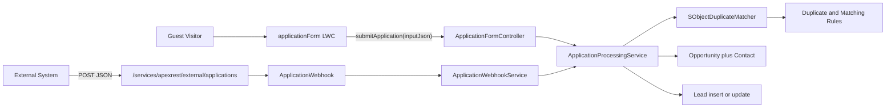
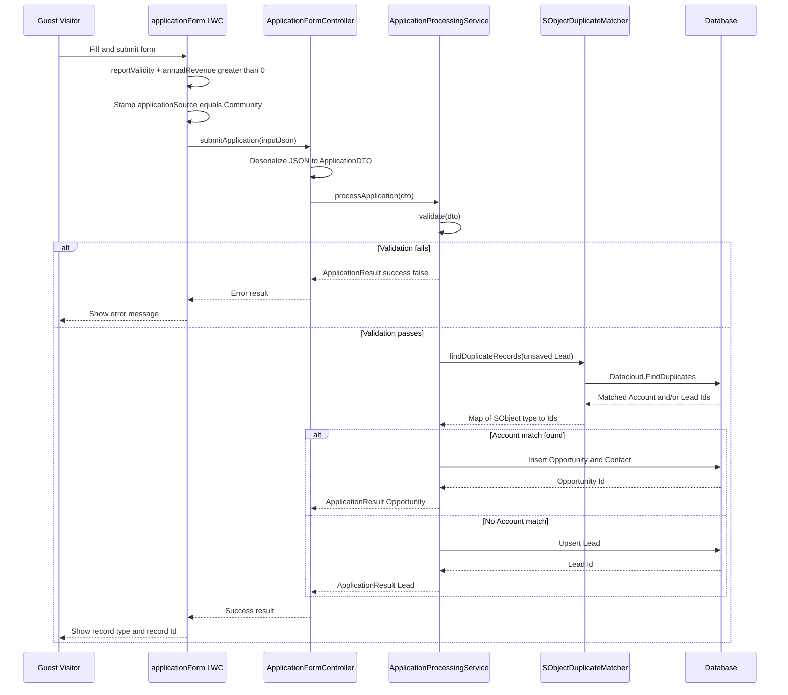
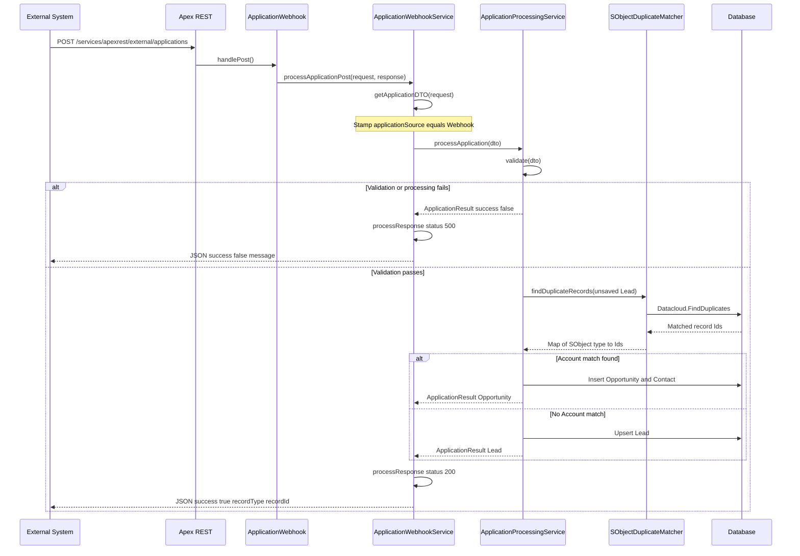

# Architecture

Deep dive into how the Cloudsquare Challenge application intake solution is structured. For setup, usage, and assumptions, see the [README](../README.md).

## Table of contents

1. [Component responsibilities](#component-responsibilities)
2. [Architecture overview](#architecture-overview)
3. [Community form sequence](#community-form-sequence)
4. [Webhook sequence](#webhook-sequence)
5. [Duplicate matching strategy](#duplicate-matching-strategy)
6. [Guest user security model](#guest-user-security-model)
7. [Validation and error handling](#validation-and-error-handling)
8. [Testability](#testability)

---

## Component responsibilities

| Component | Role |
| --- | --- |
| [`applicationForm` LWC](../force-app/main/default/lwc/applicationForm/) | Public Experience Cloud form. Client-side validation, loading state, success/error UI. Stamps `applicationSource = 'Community'`. |
| [`ApplicationFormController`](../force-app/main/default/classes/ApplicationFormController.cls) | Thin `@AuraEnabled` entry point. Deserializes `inputJson` into `ApplicationDTO` and delegates to the processing service. |
| [`ApplicationWebhook`](../force-app/main/default/classes/ApplicationWebhook.cls) | REST resource at `/services/apexrest/external/applications`. Thin `@HttpPost` entry point that forwards `RestContext` to the webhook service. |
| [`ApplicationWebhookService`](../force-app/main/default/classes/ApplicationWebhookService.cls) | Parses the REST body, stamps `applicationSource = 'Webhook'`, calls the shared service, and writes the HTTP status + JSON body. |
| [`ApplicationProcessingService`](../force-app/main/default/classes/ApplicationProcessingService.cls) | Shared business logic: validate → find duplicates → create Opportunity (+ Contact) or Lead. |
| [`SObjectDuplicateMatcher`](../force-app/main/default/classes/SObjectDuplicateMatcher.cls) | Wrapper around `Datacloud.FindDuplicates`. Runs `without sharing` so guest users can detect Accounts they cannot read. |
| [`ApplicationDTO`](../force-app/main/default/classes/ApplicationDTO.cls) | Input wrapper (`companyName`, `federalTaxId`, nested `ContactDTO`, `annualRevenue`, `applicationSource`). |
| [`ApplicationResult`](../force-app/main/default/classes/ApplicationResult.cls) | Output wrapper reused by both channels (`success`, `recordType`, `recordId`, `message`). |
| [`AccountFactory`](../force-app/main/default/classes/AccountFactory.cls) / [`LeadFactory`](../force-app/main/default/classes/LeadFactory.cls) | Test-only helpers for building seed data. |

Both channels converge on the same service:

```
LWC / Webhook  →  ApplicationProcessingService.processApplication(ApplicationDTO)
```

---

## Architecture overview



---

## Community form sequence

Public guest visitor submits the Experience Cloud form. The LWC validates, stamps the source, and calls Apex. The shared service decides Lead vs Opportunity.



---

## Webhook sequence

An external system posts JSON to the public Apex REST endpoint. The webhook service stamps the source, then reuses the same processing path as the Community form.



---

## Duplicate matching strategy

Matching is **declarative**, not hardcoded SOQL. `ApplicationProcessingService` builds an in-memory Lead from the DTO and passes it to `SObjectDuplicateMatcher`, which calls `Datacloud.FindDuplicates.findDuplicates`.

### Account match (Opportunity path)

Active metadata:

- Matching rule [`AccMR_FederalTaxId_Name`](../force-app/main/default/matchingRules/Account.matchingRule-meta.xml) — `booleanFilter` `1 OR 2`:
  - Exact match on `Federal_Tax_Id__c` (`NullNotAllowed`)
  - Exact match on `Name` (`NullNotAllowed`)
- Duplicate rule [`LeadDR_AccLead_Federal_Name`](../force-app/main/default/duplicateRules/Lead.LeadDR_AccLead_Federal_Name.duplicateRule-meta.xml) — maps Lead → Account:
  - `Lead.Company` → `Account.Name`
  - `Lead.Federal_Tax_Id__c` → `Account.Federal_Tax_Id__c`
  - `securityOption = BypassSharingRules`

Because blank values are excluded (`NullNotAllowed`), a blank Federal Tax Id effectively falls through to the Name criterion — matching the case study rule "match by Tax Id; if blank, match by Name".

When an Account Id is returned, the service creates:

1. An **Opportunity** (`Name = companyName + ' - New Application'`, `StageName = Prospecting`, `CloseDate = today + 30`, `Application_Source__c` from the DTO).
2. A **Contact** under the same Account (extra beyond the written spec, so the contact person is captured).

### Lead path (no Account match)

If no Account is found:

- A new Lead is inserted, **or**
- An existing Lead Id returned by the matcher is upserted (update instead of creating a second Lead).

`Application_Source__c` is set to `Community` or `Webhook` depending on the entry channel.

---

## Guest user security model

The public Experience Cloud site **Cloudsquare Portal** (`urlPathPrefix = cloudsquare`) runs as the guest user associated with the **Cloudsquare Portal Profile** (`Guest User License`). The public **Application Form** page (`/application-form`) hosts `c:applicationForm` with `pageAccess = Public`.

### Profile access

[`Cloudsquare Portal Profile`](../force-app/main/default/profiles/Cloudsquare%20Portal%20Profile.profile-meta.xml) grants the guest:

- Apex class access to the runtime classes (`ApplicationFormController`, `ApplicationWebhook`, `ApplicationWebhookService`, `ApplicationProcessingService`, `SObjectDuplicateMatcher`, DTO/Result wrappers).
- Field-level access to `Account.Federal_Tax_Id__c`, `Lead.Federal_Tax_Id__c`, `Lead.Application_Source__c`, `Opportunity.Application_Source__c`.

### Guest sharing rules

| Rule | Object | Criteria | Access |
| --- | --- | --- | --- |
| `Account_CloudsquarePortal` | Account | `Federal_Tax_Id__c` not equal blank | Read |
| `Lead_CloudsquarePortal` | Lead | `Application_Source__c` equals Community or Webhook | Read |

### Sharing mode split

| Class | Mode | Why |
| --- | --- | --- |
| `ApplicationProcessingService` | `with sharing` | Respect org sharing for DML performed as the guest. |
| `SObjectDuplicateMatcher` | `without sharing` | Guest users often cannot see existing Accounts; matching must still find them. The duplicate rule also uses `BypassSharingRules`. |

---

## Validation and error handling

### Server-side validation (`ApplicationProcessingService.validate`)

Required:

- Company Name, Federal Tax Id, Annual Revenue (> 0)
- Contact First Name, Last Name, Email, Phone
- Email format via regex `^[A-Za-z0-9._%+-]+@[A-Za-z0-9.-]+\.[A-Za-z]{2,}$`

Null input throws `ApplicationProcessingServiceException`. Field failures return `ApplicationResult(success = false)` with messages joined by `;`.

### DML error handling

Opportunity/Contact insert and Lead upsert use `Database.insert` / `Database.upsert` with `allOrNone = false`. Individual `Database.Error` messages are collected and returned to the caller — no unhandled DML exceptions bubble to the guest.

### Boundary error handling

| Layer | Behavior |
| --- | --- |
| `ApplicationFormController` | Catches any unexpected exception, logs it, returns a generic failure message. |
| `ApplicationWebhookService` | Known `ApplicationWebhookServiceException` → message as-is. Unexpected exceptions → generic message. Status `200` on success, `500` on failure. |

Internal stack traces are never exposed to the end user or external caller.

---

## Testability

Production classes expose injection seams so unit tests do not depend on org duplicate-rule configuration:

| Seam | Used by |
| --- | --- |
| `ApplicationProcessingService.matcher` (`@TestVisible`, `virtual` matcher) | `NoDuplicate_MatcherMock`, `AccountDuplicate_MatcherMock`, `LeadDuplicate_MatcherMock` |
| `ApplicationFormController.service` | Controller tests inject a stub processing service |
| `ApplicationWebhook.service` | `Successful_WebhookServiceMock`, `Error_WebhookServiceMock` |
| `ApplicationWebhookService` methods marked `virtual` / `@TestVisible` | Webhook service tests |

Test suite: [`ApplicationFormTests`](../force-app/main/default/testSuites/ApplicationFormTests.testSuite-meta.xml)

| Test class | Focus |
| --- | --- |
| `ApplicationProcessingServiceTest` | Lead path, Opportunity path, Lead update, validation, DML errors |
| `ApplicationFormControllerTest` | Happy path + exception translation |
| `ApplicationWebhookTest` | REST entry point success/error status codes |
| `ApplicationWebhookServiceTest` | Parsing, source stamping, response mapping |
| `SObjectDuplicateMatcherTest` | Null input and empty-result behaviour |

Smoke script for Execute Anonymous: [`script/Test_ApplicationWebhookService.cls`](../script/Test_ApplicationWebhookService.cls).
